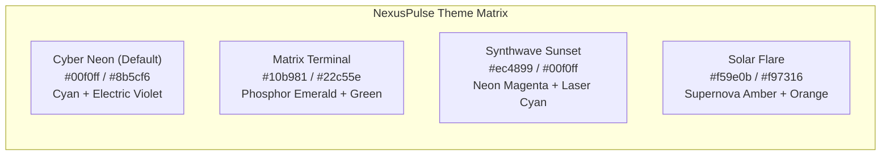

# NexusPulse Design System Specification
**Version:** 1.0.0  
**Target:** Next-Gen Real-Time Cyber-Observability & Telemetry HUD Dashboard  
**Status:** Approved for Implementation  
**Author:** Lead UI/UX & Design Systems Engineer  

---

## 1. Executive Design Vision & Core Principles

NexusPulse is engineered to be the ultimate high-performance, real-time Linux telemetry operating dashboard. It fuses the information density of high-frequency trading terminals (e.g., Bloomberg Terminal) with the aesthetic precision of aerospace avionics and cyber-telemetry HUDs (Cyberpunk 2077, Tron, Vercel, Datadog).

```
+-------------------------------------------------------------------------------------------------------------------+
|  [NEXUSPULSE HUD v1.0]   NODE-01 (Ubuntu 24.04 LTS)   UPTIME: 14d 06h 22m   [POLL: 1000ms]   [AUDIO: ON] [CYBER]  |
+-------------------------------------------------------------------------------------------------------------------+
|  [ CPU CORE LOAD: 34.2% ]   [ MEMORY: 6.2/16.0 GB ]   [ DISK: 242/512 GB ]   [ NET I/O: 12.4 MB/s (RX/TX) ]       |
+------------------------------------+------------------------------------+-----------------------------------------+
|  CPU CORE MATRIX (16 CORES)        |  REAL-TIME TIME-SERIES CANVAS      |  ACTIVE PROCESSES (TOP CPU/MEM)         |
|  [#][#][#][#] [#][#][#][#] (4.2GHz)|  ~~~~~~~~~~~~~~~~~~~~~~~~~~~~~~~~  |  PID   NAME     CPU%   MEM%   STATUS      |
|  [#][#][#][#] [#][#][#][#] (52°C)  |  CPU: 34%  RAM: 38%  I/O: 4.2MB/s  |  1204  node     14.2%  4.1%   RUNNING     |
+------------------------------------+------------------------------------+-----------------------------------------+
|  NETWORK I/O SPEEDOMETER & PORTS   |  SYSTEM LOG STREAM CONSOLE [LIVE]  |  ALERT RULES & STRESS BENCHMARK DOCK    |
|  RX: 8.2 MB/s  |  TX: 4.2 MB/s     |  [11:59:01] INFO: Telemetry OK     |  CPU Threshold: [====80%====] [TEST]    |
|  Open Ports: 22, 80, 443, 4500     |  [11:59:02] WARN: High I/O spike   |  [TRIGGER CPU STRESS 10s] [KILL PID]    |
+-------------------------------------------------------------------------------------------------------------------+
```

### Core Tenets
1. **High-Density Telemetry with Zero Clutter**: Every pixel communicates actionable state. Visual hierarchy separates critical metrics (vital telemetry) from secondary diagnostics (threads, buffers, network interfaces).
2. **Sub-second Visual Comprehension**: Use distinct neon luminous accents, micro-sparklines, dynamic gradient fills, and color-coded threshold triggers to allow operators to assess system health in under 100ms.
3. **Layered Glassmorphism & Cyber Depth**: Dark space background (`#0b0f19`) paired with semi-translucent surface cards (`rgba(17, 24, 39, 0.75)`), blurred backdrop depth (`backdrop-blur-md`), and subtle 1px border glows.
4. **Multi-Sensory Feedback**: Pure synthesized Web Audio chimes for threshold breach alerts, interactive clicks, destructive process terminations, and load test triggers.
5. **Fluid 60 FPS Micro-Interactions**: Smooth time-series canvas sliding, bar graph transitions, and hover radar-glow effects with zero jank.

---

## 2. Color System & Selectable Themes

### 2.1 Base Cyber-Observability Color Palette

The global palette establishes high-contrast, luminous indicators over deep space backgrounds:

| Token Name | Hex / RGBA | Role / Usage |
| :--- | :--- | :--- |
| `--color-primary-cyan` | `#00f0ff` | Primary active accent, network RX, normal telemetry state, active tabs |
| `--color-neon-emerald` | `#10b981` | System healthy, memory normal, service active, process running |
| `--color-warning-amber` | `#f59e0b` | Elevated load (70%-84%), swap utilization warning, temperature warning |
| `--color-critical-rose` | `#f43f5e` | Critical threshold (≥85%), CPU/RAM overload, error logs, process kill |
| `--color-dark-violet` | `#8b5cf6` | Network TX, disk read/write secondary telemetry, kernel metrics |
| `--color-bg-base` | `#0b0f19` | Deep space root canvas background |
| `--color-bg-subtle` | `#050811` | Inset terminal background, canvas graph background |
| `--color-surface-card` | `rgba(17, 24, 39, 0.75)` | Translucent glassmorphic widget containers |
| `--color-surface-card-hover` | `rgba(31, 41, 55, 0.85)` | Hover state for interactive cards and list rows |
| `--color-border-glass` | `rgba(255, 255, 255, 0.08)` | Default card border with subtle glass reflection |
| `--color-border-accent` | `rgba(0, 240, 255, 0.25)` | Active widget neon border highlight |
| `--color-text-primary` | `#f8fafc` | Main metric numbers, widget titles, primary telemetry values |
| `--color-text-secondary` | `#94a3b8` | Metric labels, subheaders, units (MB/s, %, GHz), timestamps |
| `--color-text-muted` | `#475569` | Inactive port indicators, grid lines, disabled controls |

---

### 2.2 4 Dynamic Selectable Themes

NexusPulse provides 4 runtime-switchable theme presets powered by CSS custom properties and `data-theme` attributes on `<html>`:



#### Theme 1: `Cyber Neon` (Default)
*Aesthetic: Neo-Tokyo Cyberpunk HUD. High contrast, electric blue laser telemetry.*
```css
[data-theme="cyber-neon"] {
  --theme-name: "Cyber Neon";
  --bg-app: #0b0f19;
  --bg-panel: rgba(17, 24, 39, 0.75);
  --bg-panel-solid: #111827;
  --bg-inset: #050811;
  --border-panel: rgba(0, 240, 255, 0.20);
  --border-panel-glow: rgba(0, 240, 255, 0.40);
  --accent-primary: #00f0ff;
  --accent-secondary: #8b5cf6;
  --accent-glow: 0 0 15px rgba(0, 240, 255, 0.35);
  --chart-cpu: #00f0ff;
  --chart-ram: #8b5cf6;
  --chart-disk: #10b981;
  --chart-net-rx: #00f0ff;
  --chart-net-tx: #f43f5e;
  --badge-bg: rgba(0, 240, 255, 0.12);
  --badge-text: #00f0ff;
  --badge-border: rgba(0, 240, 255, 0.3);
}
```

#### Theme 2: `Matrix Terminal`
*Aesthetic: Classic Phosphor CRT & Monochromatic Hacker Console.*
```css
[data-theme="matrix"] {
  --theme-name: "Matrix Terminal";
  --bg-app: #050e0a;
  --bg-panel: rgba(6, 26, 17, 0.80);
  --bg-panel-solid: #061a11;
  --bg-inset: #020704;
  --border-panel: rgba(16, 185, 129, 0.25);
  --border-panel-glow: rgba(16, 185, 129, 0.50);
  --accent-primary: #10b981;
  --accent-secondary: #22c55e;
  --accent-glow: 0 0 15px rgba(16, 185, 129, 0.40);
  --chart-cpu: #10b981;
  --chart-ram: #22c55e;
  --chart-disk: #34d399;
  --chart-net-rx: #10b981;
  --chart-net-tx: #fbbf24;
  --badge-bg: rgba(16, 185, 129, 0.15);
  --badge-text: #10b981;
  --badge-border: rgba(16, 185, 129, 0.35);
}
```

#### Theme 3: `Synthwave Sunset`
*Aesthetic: 80s Retro-Futurism, Outrun, Hot Magenta & Neon Cyan Gradients.*
```css
[data-theme="synthwave"] {
  --theme-name: "Synthwave Sunset";
  --bg-app: #0f071b;
  --bg-panel: rgba(27, 14, 46, 0.80);
  --bg-panel-solid: #1b0e2e;
  --bg-inset: #080310;
  --border-panel: rgba(236, 72, 153, 0.25);
  --border-panel-glow: rgba(236, 72, 153, 0.50);
  --accent-primary: #ec4899;
  --accent-secondary: #00f0ff;
  --accent-glow: 0 0 15px rgba(236, 72, 153, 0.40);
  --chart-cpu: #ec4899;
  --chart-ram: #a855f7;
  --chart-disk: #00f0ff;
  --chart-net-rx: #00f0ff;
  --chart-net-tx: #f43f5e;
  --badge-bg: rgba(236, 72, 153, 0.15);
  --badge-text: #ec4899;
  --badge-border: rgba(236, 72, 153, 0.35);
}
```

#### Theme 4: `Solar Flare`
*Aesthetic: High-Energy Star Reactor, Deep Amber, Molten Orange, Industrial Telemetry.*
```css
[data-theme="solar-flare"] {
  --theme-name: "Solar Flare";
  --bg-app: #120d06;
  --bg-panel: rgba(36, 21, 9, 0.80);
  --bg-panel-solid: #241509;
  --bg-inset: #090602;
  --border-panel: rgba(245, 158, 11, 0.25);
  --border-panel-glow: rgba(245, 158, 11, 0.50);
  --accent-primary: #f59e0b;
  --accent-secondary: #f97316;
  --accent-glow: 0 0 15px rgba(245, 158, 11, 0.40);
  --chart-cpu: #f59e0b;
  --chart-ram: #f97316;
  --chart-disk: #eab308;
  --chart-net-rx: #f59e0b;
  --chart-net-tx: #ef4444;
  --badge-bg: rgba(245, 158, 11, 0.15);
  --badge-text: #f59e0b;
  --badge-border: rgba(245, 158, 11, 0.35);
}
```

---

## 3. Typography & Numerical Telemetry

### 3.1 Font Stacks
- **Monospace Primary (Telemetry, PIDs, Metrics, Terminals, Units)**:
  `'JetBrains Mono', 'Fira Code', 'Roboto Mono', 'SF Mono', Consolas, Menlo, monospace`
- **Sans-Serif Secondary (Labels, Headings, Navigation, Modals)**:
  `'Inter', -apple-system, BlinkMacSystemFont, 'Segoe UI', Roboto, sans-serif`

### 3.2 Type Hierarchy Table

| Style Class | Font & Size | Weight | Tracking & Case | Usage |
| :--- | :--- | :--- | :--- | :--- |
| `hud-metric-giant` | Mono 32px (2.0rem) | Bold (700) | `tracking-tight` | Hero CPU/RAM/Disk percentage values |
| `hud-metric-large` | Mono 22px (1.375rem) | SemiBold (600) | `tabular-nums` | Network throughput, clock speed, uptime |
| `hud-section-title` | Sans 14px (0.875rem) | Bold (700) | `tracking-wider uppercase` | Widget card headers (e.g. `CPU CORE MATRIX`) |
| `hud-label` | Sans 11px (0.6875rem) | Medium (500) | `tracking-wide uppercase` | Field descriptors (e.g. `BUFFER CACHE`, `SWAP`) |
| `hud-table-cell` | Mono 12px (0.75rem) | Normal (400) | `tabular-nums` | Process list rows, ports, log payloads |
| `hud-badge` | Mono 10px (0.625rem) | Bold (700) | `tracking-widest uppercase` | Status pills (`HEALTHY`, `WARN`, `CRIT`, `LIVE`) |
| `hud-terminal-code` | Mono 11px (0.6875rem) | Normal (400) | `leading-relaxed` | Streaming log terminal entries |

### 3.3 Tabular Numerics Rule
All real-time updating numbers MUST enforce fixed-width figures to prevent horizontal layout jiggle during high-frequency ticks:
```css
.font-mono, .hud-metric-giant, .hud-metric-large, .hud-table-cell {
  font-variant-numeric: tabular-nums;
  font-feature-settings: "tnum" 1, "zero" 1;
}
```

---

## 4. Glassmorphism, Micro-Animations & Cyber Styling

### 4.1 Glassmorphic Panel Construction
Every widget card in NexusPulse uses a 3-layer visual composition:
1. **Backdrop Filter Layer**: `backdrop-blur-md` (12px blur) with 75% dark tint.
2. **Boundary Glow Layer**: 1px border with 10% white or 20%-25% theme accent color.
3. **Corner Accents & Inset Gradients**: Subtle cyber chamfers or top-border glowing accent highlight.

```css
/* Card Surface Utility */
.hud-glass-card {
  background: var(--bg-panel);
  backdrop-filter: blur(12px);
  -webkit-backdrop-filter: blur(12px);
  border: 1px solid var(--border-panel);
  border-radius: 8px;
  box-shadow: 0 8px 32px 0 rgba(0, 0, 0, 0.37);
  transition: border-color 0.2s ease, box-shadow 0.2s ease;
}

.hud-glass-card:hover {
  border-color: var(--border-panel-glow);
  box-shadow: var(--accent-glow), 0 8px 32px 0 rgba(0, 0, 0, 0.45);
}

/* Cyber Corner Clip (Optional High-Tech Accent) */
.hud-cyber-clip {
  clip-path: polygon(
    0 0,
    calc(100% - 12px) 0,
    100% 12px,
    100% 100%,
    12px 100%,
    0 calc(100% - 12px)
  );
}
```

### 4.2 Luminous Telemetry Indicators (Glows & Beacons)
```css
/* Real-Time Live Status Beacon */
.hud-beacon {
  width: 8px;
  height: 8px;
  border-radius: 50%;
  position: relative;
  background-color: var(--accent-primary);
}

.hud-beacon::after {
  content: '';
  position: absolute;
  top: -4px;
  left: -4px;
  right: -4px;
  bottom: -4px;
  border-radius: 50%;
  background-color: var(--accent-primary);
  opacity: 0.6;
  animation: beacon-pulse 2s infinite ease-in-out;
}

@keyframes beacon-pulse {
  0% { transform: scale(0.9); opacity: 0.8; }
  50% { transform: scale(2.0); opacity: 0; }
  100% { transform: scale(0.9); opacity: 0; }
}

/* Overload Flashing Indicator */
@keyframes critical-flash {
  0%, 100% { background-color: rgba(244, 63, 94, 0.15); border-color: rgba(244, 63, 94, 0.4); }
  50% { background-color: rgba(244, 63, 94, 0.35); border-color: rgba(244, 63, 94, 0.9); }
}

.hud-critical-alert {
  animation: critical-flash 1s infinite ease-in-out;
}
```

---

## 5. Synthesized Audio Telemetry System (Web Audio API)

NexusPulse incorporates an ultra-responsive, zero-latency Web Audio API sound synthesizer. **No external sound files (`.mp3`/`.wav`) are required.** All sound effects are generated mathematically via oscillators, gain envelopes, and biquad filters.

```mermaid
graph LR
    A[User / Telemetry Event] --> B[AudioContext Instance]
    B --> C[OscillatorNode (Sine / Triangle / Sawtooth)]
    C --> D[BiquadFilterNode (LowPass / BandPass)]
    D --> E[GainNode Envelope (ADSR)]
    E --> F[Destination: Speakers / Headphones]
```

### 5.1 Sound Effects Specification

| Sound ID | Event Trigger | Oscillator Type | Frequency Profile | Envelope (Attack / Decay) | Purpose / Feel |
| :--- | :--- | :--- | :--- | :--- | :--- |
| `softClick` | Button clicks, tab switch, filter toggle | Sine | `1200Hz -> 800Hz` | Attack: 2ms, Decay: 25ms | Tactile, subtle UI feedback |
| `tabSwitch` | Main HUD navigation tab change | Triangle | `880Hz -> 1320Hz` (Dual chime) | Attack: 3ms, Decay: 40ms | Crisp spatial movement |
| `warningAlert` | Metric threshold warning (75%-84%) | Sawtooth + LowPass | `440Hz -> 880Hz` | Attack: 5ms, Decay: 120ms | Non-intrusive caution chirp |
| `criticalAlarm` | Critical overload (≥85%), Process error | Square + BandPass | `880Hz -> 440Hz` (Rapid 3-beep) | Attack: 5ms, Decay: 80ms x3 | Urgent attention grabber |
| `actionSuccess` | Benchmark finished, rule saved | Sine | `C5 (523Hz) -> E5 (659Hz) -> G5 (784Hz)` | Attack: 5ms, Decay: 60ms/note | Positive confirmation chord |
| `actionKill` | Process `SIGTERM`/`SIGKILL` executed | Sine + Sub-bass | `180Hz -> 45Hz` | Attack: 2ms, Decay: 140ms | Heavy destructive thud |
| `benchmarkStart` | Stress test benchmark initiated | FM Modulated Sine | `150Hz -> 1600Hz` sweep | Attack: 10ms, Decay: 300ms | Sci-fi power-up riser |

### 5.2 Complete Web Audio Synthesizer Implementation
The frontend developer can drop in this standalone module (`client/src/utils/soundSynthesizer.ts`):

```typescript
/**
 * NexusPulse Web Audio Synthesizer Engine
 * Pure mathematical synthesis - 0kb assets, 0ms latency.
 */
class SoundEngine {
  private ctx: AudioContext | null = null;
  private isMuted: boolean = false;

  constructor() {
    // AudioContext will be initialized on first user interaction to comply with browser autoplay policies
  }

  private initContext() {
    if (!this.ctx) {
      const AudioContextClass = window.AudioContext || (window as unknown as { webkitAudioContext: typeof AudioContext }).webkitAudioContext;
      this.ctx = new AudioContextClass();
    }
    if (this.ctx.state === 'suspended') {
      this.ctx.resume();
    }
  }

  public setMuted(muted: boolean) {
    this.isMuted = muted;
  }

  public getMuted(): boolean {
    return this.isMuted;
  }

  /**
   * 1. Soft UI Click
   */
  public playClick() {
    if (this.isMuted) return;
    this.initContext();
    if (!this.ctx) return;

    const osc = this.ctx.createOscillator();
    const gain = this.ctx.createGain();
    const now = this.ctx.currentTime;

    osc.type = 'sine';
    osc.frequency.setValueAtTime(1200, now);
    osc.frequency.exponentialRampToValueAtTime(800, now + 0.025);

    gain.gain.setValueAtTime(0.12, now);
    gain.gain.exponentialRampToValueAtTime(0.001, now + 0.025);

    osc.connect(gain);
    gain.connect(this.ctx.destination);

    osc.start(now);
    osc.stop(now + 0.025);
  }

  /**
   * 2. Tab / View Switch
   */
  public playTabSwitch() {
    if (this.isMuted) return;
    this.initContext();
    if (!this.ctx) return;

    const now = this.ctx.currentTime;
    [880, 1320].forEach((freq, i) => {
      if (!this.ctx) return;
      const osc = this.ctx.createOscillator();
      const gain = this.ctx.createGain();
      const startTime = now + i * 0.025;

      osc.type = 'triangle';
      osc.frequency.setValueAtTime(freq, startTime);

      gain.gain.setValueAtTime(0.1, startTime);
      gain.gain.exponentialRampToValueAtTime(0.001, startTime + 0.04);

      osc.connect(gain);
      gain.connect(this.ctx.destination);

      osc.start(startTime);
      osc.stop(startTime + 0.04);
    });
  }

  /**
   * 3. Warning Alert Chirp
   */
  public playWarning() {
    if (this.isMuted) return;
    this.initContext();
    if (!this.ctx) return;

    const osc = this.ctx.createOscillator();
    const filter = this.ctx.createBiquadFilter();
    const gain = this.ctx.createGain();
    const now = this.ctx.currentTime;

    osc.type = 'sawtooth';
    osc.frequency.setValueAtTime(440, now);
    osc.frequency.linearRampToValueAtTime(880, now + 0.12);

    filter.type = 'lowpass';
    filter.frequency.setValueAtTime(1600, now);

    gain.gain.setValueAtTime(0.15, now);
    gain.gain.exponentialRampToValueAtTime(0.001, now + 0.15);

    osc.connect(filter);
    filter.connect(gain);
    gain.connect(this.ctx.destination);

    osc.start(now);
    osc.stop(now + 0.15);
  }

  /**
   * 4. Critical Alarm (Rapid 3-tone Warning)
   */
  public playCritical() {
    if (this.isMuted) return;
    this.initContext();
    if (!this.ctx) return;

    const now = this.ctx.currentTime;
    for (let i = 0; i < 3; i++) {
      const osc = this.ctx.createOscillator();
      const gain = this.ctx.createGain();
      const startTime = now + i * 0.09;

      osc.type = 'square';
      osc.frequency.setValueAtTime(880, startTime);
      osc.frequency.setValueAtTime(660, startTime + 0.04);

      gain.gain.setValueAtTime(0.18, startTime);
      gain.gain.exponentialRampToValueAtTime(0.001, startTime + 0.08);

      osc.connect(gain);
      gain.connect(this.ctx.destination);

      osc.start(startTime);
      osc.stop(startTime + 0.08);
    }
  }

  /**
   * 5. Process Kill / Termination Thud
   */
  public playKillThud() {
    if (this.isMuted) return;
    this.initContext();
    if (!this.ctx) return;

    const osc = this.ctx.createOscillator();
    const gain = this.ctx.createGain();
    const now = this.ctx.currentTime;

    osc.type = 'sine';
    osc.frequency.setValueAtTime(180, now);
    osc.frequency.exponentialRampToValueAtTime(40, now + 0.14);

    gain.gain.setValueAtTime(0.25, now);
    gain.gain.exponentialRampToValueAtTime(0.001, now + 0.14);

    osc.connect(gain);
    gain.connect(this.ctx.destination);

    osc.start(now);
    osc.stop(now + 0.14);
  }

  /**
   * 6. Action Success Arpeggio (C5-E5-G5)
   */
  public playSuccess() {
    if (this.isMuted) return;
    this.initContext();
    if (!this.ctx) return;

    const notes = [523.25, 659.25, 783.99]; // C5, E5, G5
    const now = this.ctx.currentTime;

    notes.forEach((freq, index) => {
      if (!this.ctx) return;
      const osc = this.ctx.createOscillator();
      const gain = this.ctx.createGain();
      const startTime = now + index * 0.06;

      osc.type = 'sine';
      osc.frequency.setValueAtTime(freq, startTime);

      gain.gain.setValueAtTime(0.15, startTime);
      gain.gain.exponentialRampToValueAtTime(0.001, startTime + 0.12);

      osc.connect(gain);
      gain.connect(this.ctx.destination);

      osc.start(startTime);
      osc.stop(startTime + 0.12);
    });
  }

  /**
   * 7. Benchmark Riser Sweep
   */
  public playBenchmarkStart() {
    if (this.isMuted) return;
    this.initContext();
    if (!this.ctx) return;

    const osc = this.ctx.createOscillator();
    const gain = this.ctx.createGain();
    const now = this.ctx.currentTime;

    osc.type = 'sawtooth';
    osc.frequency.setValueAtTime(150, now);
    osc.frequency.exponentialRampToValueAtTime(1600, now + 0.28);

    gain.gain.setValueAtTime(0.18, now);
    gain.gain.exponentialRampToValueAtTime(0.001, now + 0.30);

    osc.connect(gain);
    gain.connect(this.ctx.destination);

    osc.start(now);
    osc.stop(now + 0.30);
  }
}

export const sound = new SoundEngine();
```

---

## 6. Responsive HUD Layout Grid & Component Hierarchy

### 6.1 Breakpoint System
- **Desktop Ultrawide (≥ 1920px)**: 12-Column high-density command center layout. Dual-column telemetry feeds, side-by-side terminal & process manager.
- **Standard Desktop (1280px - 1919px)**: 12-Column balanced grid. All 10 widget modules simultaneously visible with minimal scrolling.
- **Tablet / Laptop (768px - 1279px)**: 6-Column stacked grid. Tabbed view or collapsible panels for secondary widgets (Logs / Alerts).
- **Mobile (< 768px)**: 1-Column vertical stack. Top Quick HUD cards convert into a 2x2 grid, process table switches to touch cards.

```
+---------------------------------------------------------------------------------------------------+
| Desktop Grid (12 Columns)                                                                         |
+---------------------------------------------------------------------------------------------------+
| [ Header & System Command Bar ] (col-span-12)                                                     |
+-------------------+-------------------+-------------------+---------------------------------------+
| CPU Card (col 3)  | Memory Card (col 3)| Storage (col 3)  | Network I/O (col 3)                   |
+-------------------+-------------------+-------------------+---------------------------------------+
| CPU Core Matrix (col-span-4)          | Real-Time Time-Series Oscilloscope Canvas (col-span-8)    |
+---------------------------------------+-----------------------------------------------------------+
| Memory / Swap Breakdown (col-span-4)  | High-Density Interactive Process Manager (col-span-8)     |
+---------------------------------------+-----------------------------------------------------------+
| Network Ports Monitor (col-span-4)    | Live Matrix Terminal Logs Console (col-span-8)            |
+---------------------------------------+-----------------------------------------------------------+
| Alert Rules Engine (col-span-6)       | Synthetic Server Stress Benchmark Console (col-span-6)    |
+---------------------------------------------------------------------------------------------------+
```

---

### 6.2 Component Hierarchy & Visual Specifications

#### Component 1: `Header & Telemetry Command Bar`
- **Location**: Top fixed banner (Height: `64px`, `px-6`).
- **Elements**:
  1. **Brand Logo & Version**: `NexusPulse` with neon cyan beacon and glowing pulse.
  2. **Host Specifications Badge**: Hostname (e.g. `linux-edge-01`), OS distribution badge (`Ubuntu 24.04.1 LTS`), Kernel release (`6.8.0-49-generic`), CPU architecture (`x86_64 / 16 Cores`).
  3. **Uptime Counter**: Live tick format `14d 06h 22m 15s`.
  4. **Telemetry Poll Rate Selector**: Segmented pill button `[500ms | 1000ms | 2000ms | 5000ms]`.
  5. **Theme Switcher Dropdown / Pills**: `Cyber Neon`, `Matrix`, `Synthwave`, `Solar Flare`.
  6. **Audio Sound Toggle**: Speaker icon button with on/off sound indicator badge.
  7. **WebSocket Live Connection Badge**: Neon green `CONNECTED (12ms)` or blinking amber/rose `RECONNECTING`.

#### Component 2: `Quick Metric Hero HUD (4-Card Dock)`
- **Grid Layout**: `grid grid-cols-1 sm:grid-cols-2 lg:grid-cols-4 gap-4`.
- **Card 1: CPU Total Load**:
  - Big metric `34.8%` with dynamic color (Green `<70%`, Amber `70-84%`, Rose `≥85%`).
  - Sub-metrics: Clock speed `4.20 GHz`, 1m/5m/15m load average `[1.42, 1.88, 1.65]`, Temperature `52°C`.
  - Sparkline: Mini 20-point SVG sparkline showing recent trend.
- **Card 2: Memory (RAM)**:
  - Big metric `6.4 / 16.0 GB` (`40.0%`).
  - Sub-metrics: Free `9.6 GB`, Buffers/Cache `3.2 GB`, Swap `0.2 / 4.0 GB (5%)`.
  - Progress bar with multi-segment color fill (Active, Buffers, Free).
- **Card 3: Storage (Disk)**:
  - Big metric `242 / 512 GB` (`47.2%`).
  - Sub-metrics: Read `4.8 MB/s`, Write `12.1 MB/s`, Mount point `/ (ext4)`.
  - Secondary mount quick toggle if multiple disks detected.
- **Card 4: Network Throughput (I/O)**:
  - Big metric `14.2 MB/s` (Combined Rx + Tx).
  - Sub-metrics: `↓ RX 10.4 MB/s`, `↑ TX 3.8 MB/s`, Active Interface `eth0` (or `wlan0`).
  - Total cumulative transferred `↓ 42.8 GB / ↑ 18.2 GB`.

#### Component 3: `CPU Core Matrix Visualizer`
- **Layout**: Dynamic responsive grid (e.g. 4x2, 4x4, 8x4) based on core count (2 to 64 cores).
- **Visual Design**:
  - Each core has an individual micro-card: Core ID (`#01` ~ `#16`), mini vertical/horizontal gauge bar, percentage value.
  - Temperature heat-map tinting when thermals rise above 75°C.
  - Per-core load histogram with peak hold indicator.

#### Component 4: `Memory & Storage Breakdown Dock`
- **RAM Segmented Visualizer**: Multi-colored stacked progress bar:
  - Cyan: Active App Memory (`5.2 GB`)
  - Violet: Slab / Cached Filesystem (`2.4 GB`)
  - Emerald: Buffers (`0.8 GB`)
  - Dark Slate: Free / Available (`7.6 GB`)
- **Swap Monitor**: Dedicated gauge bar with warning threshold alert at >50%.
- **Disk Partition List**: Table/Cards for each mounted filesystem:
  - Mount point (`/`, `/home`, `/data`, `/mnt/backup`).
  - Filesystem type (`ext4`, `btrfs`, `zfs`, `overlay`).
  - Space breakdown (`Used / Total`, percentage gauge bar, read/write ops).

#### Component 5: `Real-Time Sliding Time-Series Oscilloscope (Canvas)`
- **Technology**: HTML5 2D Canvas with `requestAnimationFrame` for buttery 60 FPS rendering.
- **Data Buffer**: 60 rolling historical ticks (60s sliding window).
- **Features**:
  - Dual/Quad stream selection toggle (`CPU`, `Memory`, `Disk Read/Write`, `Network Rx/Tx`).
  - Translucent neon gradient fills under line curves (`createLinearGradient`).
  - Dynamic Y-axis auto-scaling with grid crosshair telemetry readout on mouse hover.
  - Peak markers and average threshold guideline overlay.

#### Component 6: `Network I/O & Port Scanner Monitor`
- **Network Speedometer Graphs**: Dual real-time gauges for Download (Rx) and Upload (Tx).
- **Network Interfaces Drawer**: Dropdown to switch between interfaces (`eth0`, `docker0`, `lo`, `wlan0`).
- **Open TCP Ports Monitor**:
  - Badge grid of currently open listening ports (e.g., `22 (SSH)`, `80 (HTTP)`, `443 (HTTPS)`, `4500 (NexusPulse)`).
  - Port status indicator (Healthy / Listening / Active connection count).

#### Component 7: `Interactive Process Manager HUD Table`
- **Features**:
  - Live sortable columns: `PID`, `Process Name`, `User`, `CPU %`, `MEM %`, `Virtual Mem`, `State` (`R`, `S`, `Z`), `Actions`.
  - Instant Filter / Search input with hotkey (`/` or `Ctrl+K`).
  - Color-coded CPU% & MEM% micro-bars inside table cells for instant scanning.
  - Security Confirmation Modal for `Kill Process`:
    - Displays PID, process name, command path, user ownership.
    - Signal selector: `SIGTERM (15)` vs `SIGKILL (9)`.
    - Safety slider or double-confirmation button to prevent accidental termination.
    - Plays `actionKill` sound on execution.

#### Component 8: `Live System Logs Terminal Console`
- **Aesthetic**: CRT / Phosphor terminal console with matrix glow.
- **Controls**:
  - Log Level Filter pills: `ALL`, `INFO` (Cyan), `WARN` (Amber), `ERROR` (Rose), `METRIC` (Violet).
  - Search Query input for regex / string matching.
  - `Auto-Scroll: ON/OFF` toggle button.
  - `Clear Console` and `Export to .log / .json` buttons.
- **Log Item Structure**: Timestamp `[HH:mm:ss.SSS]`, Level badge, Source tag (`[telemetry]`, `[systemd]`, `[kernel]`), Formatted message payload.

#### Component 9: `Alert Rules Engine & History`
- **Threshold Rule Sliders**:
  - CPU Usage Alert Threshold (Default `80%`)
  - Memory Usage Alert Threshold (Default `85%`)
  - Disk Space Alert Threshold (Default `90%`)
- **Sound Alert Toggle per Rule**: Option to enable/disable synthesized sound when threshold is breached.
- **Trigger History Feed**: Reverse-chronological list of recent alerts with trigger timestamp, peak value, and resolved state.

#### Component 10: `Server Load Benchmark Tool (Synthetic Stress)`
- **Purpose**: Safe, controlled synthetic load generator to demonstrate live telemetry reactions in real-time.
- **Controls**:
  - Target: `CPU Stress (All Cores)`, `CPU Stress (Single Core)`, `RAM Memory Allocation`.
  - Duration Slider: `5s`, `10s`, `15s`, `30s` (Hard-capped safety timeout).
  - Big Neon `[ INITIATE STRESS TEST ]` button.
  - Active Stress Countdown HUD with visual overload warning aura.
  - Instant `[ ABORT TEST ]` emergency stop button.

---

## 7. Tailwind CSS Configuration & Tokens

The following Tailwind configuration (`client/tailwind.config.js`) maps the NexusPulse design tokens directly to utility classes:

```javascript
/** @type {import('tailwindcss').Config} */
export default {
  content: [
    "./index.html",
    "./src/**/*.{js,ts,jsx,tsx}",
  ],
  darkMode: 'class',
  theme: {
    extend: {
      colors: {
        cyber: {
          cyan: '#00f0ff',
          emerald: '#10b981',
          amber: '#f59e0b',
          rose: '#f43f5e',
          violet: '#8b5cf6',
          dark: '#0b0f19',
          darker: '#050811',
          card: 'rgba(17, 24, 39, 0.75)',
          'card-hover': 'rgba(31, 41, 55, 0.85)',
          border: 'rgba(255, 255, 255, 0.08)',
          'border-neon': 'rgba(0, 240, 255, 0.25)',
        },
      },
      fontFamily: {
        mono: ['JetBrains Mono', 'Fira Code', 'Roboto Mono', 'ui-monospace', 'monospace'],
        sans: ['Inter', 'system-ui', '-apple-system', 'sans-serif'],
      },
      boxShadow: {
        'neon-cyan': '0 0 15px rgba(0, 240, 255, 0.35)',
        'neon-emerald': '0 0 15px rgba(16, 185, 129, 0.35)',
        'neon-rose': '0 0 15px rgba(244, 63, 94, 0.40)',
        'neon-amber': '0 0 15px rgba(245, 158, 11, 0.35)',
        'neon-violet': '0 0 15px rgba(139, 92, 246, 0.35)',
        'glass-card': '0 8px 32px 0 rgba(0, 0, 0, 0.37)',
      },
      animation: {
        'beacon': 'beacon-pulse 2s infinite ease-in-out',
        'critical-pulse': 'critical-flash 1s infinite ease-in-out',
        'scanline': 'scanline-pass 8s linear infinite',
      },
      keyframes: {
        'beacon-pulse': {
          '0%': { transform: 'scale(0.9)', opacity: '0.8' },
          '50%': { transform: 'scale(2.0)', opacity: '0' },
          '100%': { transform: 'scale(0.9)', opacity: '0' },
        },
        'critical-flash': {
          '0%, 100%': { backgroundColor: 'rgba(244, 63, 94, 0.15)', borderColor: 'rgba(244, 63, 94, 0.4)' },
          '50%': { backgroundColor: 'rgba(244, 63, 94, 0.35)', borderColor: 'rgba(244, 63, 94, 0.9)' },
        },
        'scanline-pass': {
          '0%': { transform: 'translateY(-100%)' },
          '100%': { transform: 'translateY(1000%)' },
        },
      },
    },
  },
  plugins: [],
}
```

---

## 8. Frontend Engineering Directives & Best Practices

1. **Canvas Time-Series Optimization**:
   - Always adjust for high DPI displays: `canvas.width = rect.width * window.devicePixelRatio`.
   - Clear canvas with `ctx.clearRect(0, 0, width, height)` and draw with path batching.
   - Use `requestAnimationFrame` loop synced with WebSocket tick updates.
2. **Process List Sorting & Virtualization**:
   - Compute sort on client state or delegate to backend query (`?sort=cpu&limit=50`).
   - Default sort: CPU % descending (`sortOrder = 'desc'`).
3. **Sound Throttling**:
   - Prevent warning/critical audio spam by debouncing alert sounds with a 5-second cooldown per alert rule.
4. **Theme Persistence**:
   - Store selected theme and audio mute state in `localStorage` (`nexuspulse_theme`, `nexuspulse_muted`, `nexuspulse_poll_rate`).
   - Read from `localStorage` on initial page load to eliminate theme flicker.

---
*NexusPulse Design System v1.0.0 — Designed for Speed, Mission-Critical Clarity, and Deep Space Cyber Aesthetics.*
